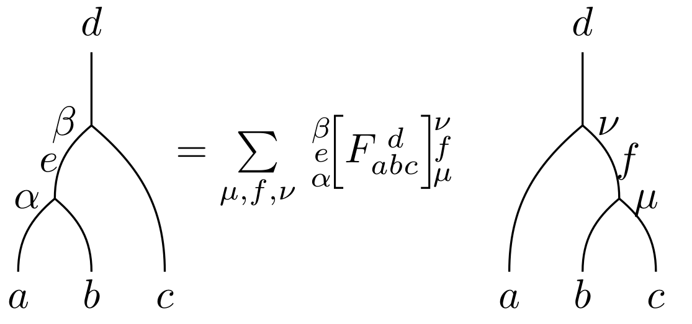
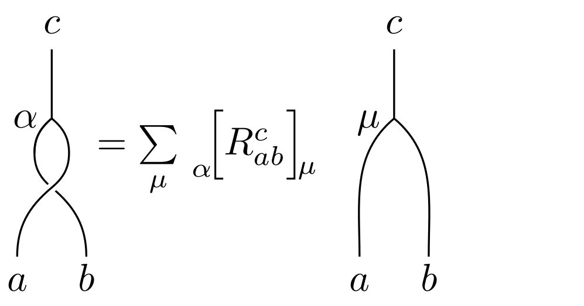

# Categorical data for low rank unitary fusion categories

Data for all multiplicity free unitary fusion categories of rank &le; 6 up to equivalence.
For those with braidings, all inequivalent braidings are included.

---

### Conventions:

Fusion rings are indexed according to the [AnyonWiki]

##### File content

##### `Nabc.txt:`

`a b c Nabc`

##### `F.txt:`

`a b c d α e β μ f ν ReF ImF`

##### `R.txt:`

`a b c α μ ReR ImR`

---

### Directory structure:

`./uFC/` contains txt files for all multiplicity free (braided) fusion categories up to rank 6.
`./uFC/FR_r_n_m/Nabc.txt` contains the non-zero fusion rules. Each categorification is contained in a numbered subdirectory, with all braidings included in subsequent subdirectories.

[anyonwiki]: http://www.thphys.nuim.ie/AnyonWiki/index.php/List_of_small_multiplicity-free_fusion_rings
